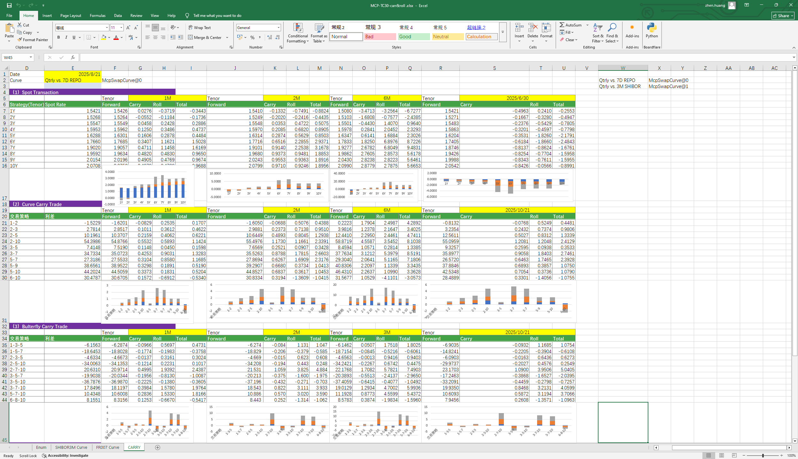

# **Carry&Roll案例**

> 访问猛犸期权定价系统，支持外汇期权和结构化产品定价估值！

提供即期交易、曲线利差交易、碟式利差交易、远期交易相关的利率、利差、Carry、Roll、远期等相关指标的计算。
点击下面图片下载模板：

---

---

## **Carry&Roll案例模板使用函数说明**

### **1. 节假日构造函数**
- **[McpCalenders](/zh/latest/api/calendar.html#excel-mcpcalenders-ccy)**：构造一个或多个货币对的节假日对象。

### **2. SwapCurve构造函数**
- **[McpVanillaSwapCurveData](/zh/latest/api/yieldcurve.html#excel-mcpvanillaswapcurvedata-args-data)**：构造Vanilla Swap Curve对象。
- **[McpSwapCurve](/zh/latest/api/yieldcurve.html#excel-mcpswapcurve-args1-args2-args3-args4-args5-fmt-vp)**：构造Swap Curve对象。

### **3. 存放不同产品函数**
- **[McpCalibrationSet](/zh/latest/api/bondcurve.html#excel-mcpcalibrationset-args)**：用于在构建利率曲线时，放入不同产品（如Depo、Swap、Bond等）并通过剥息法校准曲线。

### **4. 计算相关函数**
- **[SwapCurveParSwapRate](/zh/latest/api/yieldcurve.html#excel-swapcurveparswaprate-curve-start-end)**：计算利率。
- **[SwapCurveCarry](/zh/latest/api/yieldcurve.html#excel-swapcurvecarry-curve-horizon-maturityperiod)**：计算Carry。
- **[SwapCurveRoll](/zh/latest/api/yieldcurve.html#excel-swapcurveroll-curve-horizon-maturityperiod)**：计算Roll。

